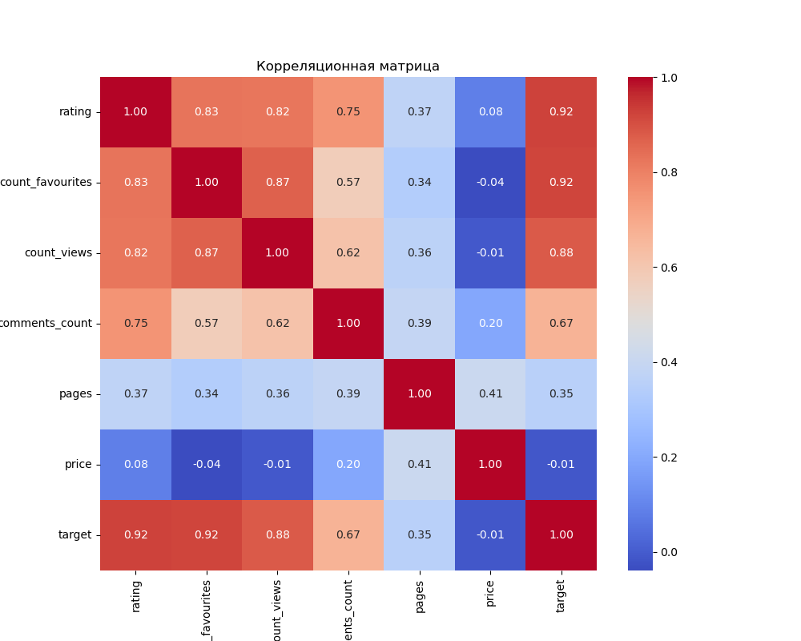

# 📚 Лабораторная работа №2 — Анализ и кластеризация данных о книгах

🔍 Исследовательский анализ данных (EDA) и кластеризация книг с использованием алгоритма **K-Means**.  
Работа включает предобработку данных, устранение пропусков и выбросов, визуализацию признаков, кластеризацию, оценку качества кластеров и реализацию алгоритма вручную.

---

## 🖼️ Пример визуализации

---

## 🧰 Используемые библиотеки

- `pandas`
- `matplotlib`, `seaborn`
- `scikit-learn`

---

## 📊 Основные этапы проекта

- Загрузка и предварительный анализ данных
- Очистка и удаление аномалий
- Построение гистограмм, боксплотов, тепловых карт
- Нормализация данных
- Кластеризация K-Means
- Оценка кластеров (Silhouette score)
- Ручная реализация K-Means
